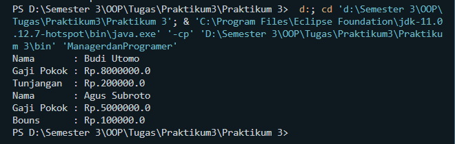

# <p align=center>**Praktikum 3**
```sh
Nama    : Achmad Mahfud
NIM     : 312110520
Kelas   : TI.21.C5
```
## **Program :** 
### Pegawai : 
```sh
public class Pegawai {
    private String nama;
    private double gajiPokok;

    public void setNama(String nama) {
        this.nama = nama;
    }
    public void setGajiPokok(double gajiPokok) {
        this.gajiPokok = gajiPokok;
    }
    public String getNama() {
        return nama;
    }
    public double getGajiPokok() {
        return gajiPokok;
    }
    
    public void cetakInfo(){
        System.out.println("Nama       : "+ this.nama);
        System.out.println("Gaji Pokok : Rp."+ this.gajiPokok);
    }
}
```
### Manager : 
```sh
public class Manager extends Pegawai{
    private double tunjangan;

    public void settunjangan(double tunjangan){
        this.tunjangan = tunjangan;
    }
    public double gettunjangan(){
        return tunjangan;
    }
    
    public void cetakTunjangan(){
        System.out.println("Tunjangan  : Rp.20000" + this.tunjangan);
    }
}
```
### Programer : 
```sh
public class Programer extends Pegawai{
    private double bonus;

    public void setBonus(double bonus){
        this.bonus = bonus;
    }
    public double getBonus(){
        return bonus;
    }
    public void cetakBonus(){
        System.out.println("Bouns      : Rp.10000" + this.bonus);
    }
}
```
### ManagerdanProgramer : 
```sh
public class ManagerdanProgramer {
    public static void main(String[] args){
        Manager budi = new Manager();

        budi.setNama("Budi Utomo");
        budi.setGajiPokok(8000000);
        budi.cetakInfo();
        budi.cetakTunjangan();

        Programer agus = new Programer();
        agus.setNama("Agus Subroto");
        agus.setGajiPokok(5000000);
        agus.cetakInfo();
        agus.cetakBonus();

        
    }
}
```
## **Output Program :** 
